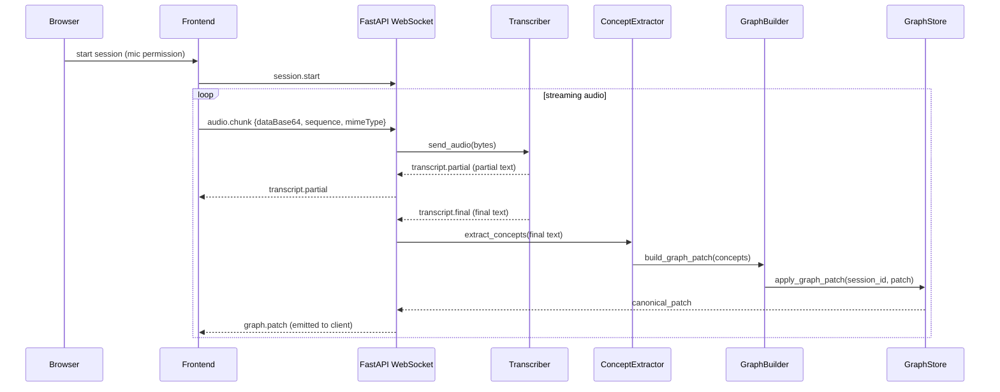

# YapMap — live conversation graph explorer

A compact, extensible system for real-time conversation transcription, concept extraction, and incremental knowledge-graph construction.

This repository contains a FastAPI backend, a Vite + React frontend, local model helpers (embeddings + generator), and optional offline transcription models (Vosk). It is built to receive live audio streams from the browser, transcribe them, extract concepts, generate a patch of a graph (nodes and edges), persist/merge the patch in a graph store, and stream canonicalized graph updates back to clients for visualization.

Table of contents
- Overview
- Architecture (diagram)
- Live session sequence (diagram)
- Graph persistence flow (diagram)
- Components & important files
- Setup & quickstart
- Development & testing
- Deployment notes
- Security considerations
- Contribution notes


## Overview

YapMap turns spoken conversation into an evolving graph of concepts and claim-like nodes. Key features:

- Real-time audio ingestion over WebSocket (`/ws/live/{session_id}`)
- Pluggable transcription providers: `mock`, `vosk`, and a placeholder for `openai_realtime`
- Concept extraction and graph patch generation (KeyBERT + embeddings)
- Merge logic in the graph store to deduplicate/merge nodes using normalized labels and fuzzy matching
- Frontend visualization (graph canvas, replay, transcript panel)


## Architecture (high level)

```mermaid
graph LR
	Browser[Browser / Frontend] -->|REST / WebSocket| Frontend[Frontend - Vite + React]
	Frontend -->|HTTP / WebSocket| API(FastAPI backend)
	subgraph Backend
		API --> WS[WS / live_audio endpoint]
		WS --> TranscriberManager[Transcriber Manager]
		TranscriberManager --> Vosk[VoskTranscriber]
		TranscriberManager --> Mock[MockTranscriber]
		TranscriberManager --> OpenAI[OpenAIRealtimeTranscriber (stub)]
		TranscriberManager --> ConceptExtractor[ConceptExtractor]
		ConceptExtractor --> GraphBuilder[GraphBuilder]
		GraphBuilder --> GraphStore[Graph Store (SQLModel + DB)]
		LocalModels[LocalModelManager: embeddings & generator] --> ConceptExtractor
		LocalModels --> GraphBuilder
	end
	GraphStore -->|graph.patch| Frontend
	note right of GraphStore: backend/models contains large model files; manifest at backend/models/manifest.json
```


## Live session sequence

This sequence shows how a single live session (microphone) flows through the system.




## Graph persistence flow

The `apply_graph_patch` logic attempts an in-place merge of incoming nodes/edges:

```mermaid
flowchart TD
	Patch[Incoming graph.patch] --> Norm[Normalize labels]
	Norm --> Exact[Exact match on normalized_label]
	Exact -->|found| Merge[Merge segments, update importance, timestamps]
	Exact -->|not found| Fuzzy[Fuzzy-match candidates (difflib.SequenceMatcher)]
	Fuzzy -->|score >= threshold| Merge
	Fuzzy -->|no match| Create[Create new node/edge (UUID)]
	Merge --> Commit[DB commit & refresh]
	Create --> Commit
	Commit --> Canon[Query final persisted rows -> canonical patch]
	Canon --> Return[Return canonical patch to caller]
```


## Components & important files

- Backend
	- `backend/app/main.py` — FastAPI app factory and CORS config
	- `backend/app/config.py` — pydantic-based `Settings` (uses `.env` by default)
	- `backend/app/ws/live_audio.py` — WebSocket handler for live audio
	- `backend/app/services/transcription/` — transcriber implementations (`mock_transcriber.py`, `vosk_transcriber.py`, `openai_realtime.py` (stub))
	- `backend/app/services/local_models.py` — lazy-loading embedding + generation helpers
	- `backend/app/services/graph_builder.py` — build graph patches from extracted concepts
	- `backend/app/services/graph_store.py` — `apply_graph_patch` merge and persistence logic
	- `backend/app/models/graph.py` — `GraphNode` and `GraphEdge` SQLModel definitions
	- `backend/models/manifest.json` — maps logical model names to local paths (created by `scripts/download_models.py`)

- Frontend
	- `frontend/src` — React + TypeScript app (Vite)
	- `frontend/src/websocket/liveAudioSocket.ts` — client WebSocket handling
	- `frontend/src/components` — UI components: `GraphCanvas`, `TranscriptPanel`, etc.

- Scripts
	- `scripts/download_models.py` — helper to download/store model snapshots and write `manifest.json`
	- `scripts/generate_graph_from_transcript.py` — helper utility


## Setup & quickstart

Prerequisites

- Python 3.10+ (backend)
- Node.js 18+ (frontend)
- Optional: models (Vosk, HF) if you want offline transcription & local embeddings

Backend (local dev)

1. Create and activate a virtual environment:

```powershell
cd backend
python -m venv .venv
. .venv/Scripts/Activate.ps1    # PowerShell (Windows)
pip install -r requirements.txt
```

2. Provide runtime settings via environment variables or a `.env` file in `backend/` (this repo includes `.env.example`):

```
ENVIRONMENT=development
DATABASE_URL=sqlite:///./yapmap.db
FRONTEND_ORIGIN=http://localhost:5173
TRANSCRIPTION_PROVIDER=mock
OPENAI_API_KEY=
```

3. Run the API (from `backend/`):

```powershell
uvicorn app.main:app --reload --host 0.0.0.0 --port 8000
```

Frontend (local dev)

```bash
cd frontend
npm install
npm run dev
# Open http://localhost:5173
```

Model files

- To use local HF / Vosk models, run `python ../scripts/download_models.py` or place models into `backend/models/` and create `backend/models/manifest.json` mapping `embed_model`, `gen_model`, `vosk_model` to local paths.


## Development & testing

- Run backend tests (from repo root):

```bash
cd backend
pytest -q
```

- Linting / formatting: add your preferred tooling (black, ruff, eslint for frontend).


## Deployment notes

- Use a production database (Postgres) and configure `DATABASE_URL` accordingly.
- Run FastAPI behind an ASGI server (Uvicorn + Gunicorn) and put it behind a reverse proxy (Nginx).
- Configure CORS `FRONTEND_ORIGIN` to the production URL.
- For long-running real-time workloads, prefer a robust transcriber deployment (Vosk on a separate worker or a managed realtime API).
- Do not store secrets (API keys) in the repo — use environment variables / secret stores.


## Security considerations

- `.env` and keys: do not commit `.env` — this repository now ignores `.env` via `.gitignore`.
- Validate and limit incoming WebSocket payloads — `backend/app/ws/live_audio.py` implements base64 validation and a 5MB-per-chunk limit to protect memory.
- Transformer `pipeline` calls are invoked with `trust_remote_code=False` when supported to avoid executing arbitrary code from model repos.
- Run a secret scanner before pushing to public remote (git-secrets / truffleHog).


## API surface (quick)

- REST
	- `POST /api/sessions/` — create a new session
	- `GET /api/sessions/` — list sessions
	- `GET /api/sessions/{id}` — get session
	- `DELETE /api/sessions/{id}` — delete session
	- `POST /api/nlp/extract` — text -> extracted concepts (used by tooling)

- WebSocket
	- `ws://<host>/ws/live/{session_id}` — real-time audio stream; messages: `session.start`, `audio.chunk`, `session.stop`; server sends `transcript.partial`, `transcript.final`, `graph.patch`, `processing.status` responses.

## Files to review first

- [backend/app/config.py](backend/app/config.py#L1-L200) — runtime settings
- [backend/app/ws/live_audio.py](backend/app/ws/live_audio.py#L1-L400) — primary realtime flow
- [backend/app/services/graph_store.py](backend/app/services/graph_store.py#L1-L400) — patch merging and persistence
- [backend/app/services/local_models.py](backend/app/services/local_models.py#L1-L300) — embedding/generation loaders
- [frontend/src/websocket/liveAudioSocket.ts](frontend/src/websocket/liveAudioSocket.ts#L1-L240) — client WS logic
